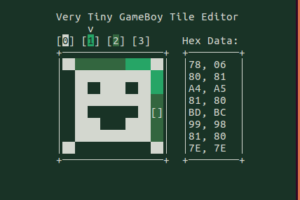

# vtGBte (Very Tiny GameBoy Tile Editor)

A simple *keyboard-controlled* Game Boy tile editor for Unix systems written in C using ncurses library. 
Hope you'll find it useful. 

## Building

First you'll need to clone the repo:
`$ git clone https://github.com/paul-arutyunov/vtGBte.git`
`$ cd vtGBte`

To build the project, run
`$ make`
in your terminal.

This will create binary file in the repo dir.

To install the program, simply run
`# make install`

This will install the binary to the directory specified in the makefile (`/usr/local/bin` by default).

Expectably, to uninstall run
`# make uninstall`

Before re-building always run
`$ make clean`
This will remove all object files in the repo dir.
Also it'd be nice to have a script named, say, "rebuild.sh" located in the repo dir and consisting of two lines.

*Note that you'll need `ncurses` library located somwhere on your computer.*
*And `make`.*
*And `install`.*
*And `rm`.*
*And, if thruth to be told, a C compiler is required too.*
*Why am I writing this.*

## Usage

Asset is always 256 tiles in size.
vtGBte saves assets in raw binary format. This means that you only have to 
save your work to a file, named, say, 'sprites.bin', you will only need to 
include it in your assembly file, for example, that's how you do it in RGBDS: 

`incbin "sprites.bin"`

You would likely do not use up the whole asset, so you can include only a part of file:

`incbin "sprites.bin",0,32`

In RGBDS, this will include only 32 bytes (2 tiles) starting at byte 0. 

Minimalistic!

## Commands

Drawing:
Arrow keys to move the cursor, number keys (1..4) to select color, SPACE to plot a pixel, 
F to fill the whole tile with selected color. 

R to redraw screen (similar to ^R in Nethack) - useful if your screen is ruined for any reason. 

Shift-S to resize canvas (up to 32x32 size supported)

G - show guide

, and . keys to shift tile

S to save asset to file

L to load asset from file

## So...

Be sure to make suggestions or contribute. 
You're welcome!
